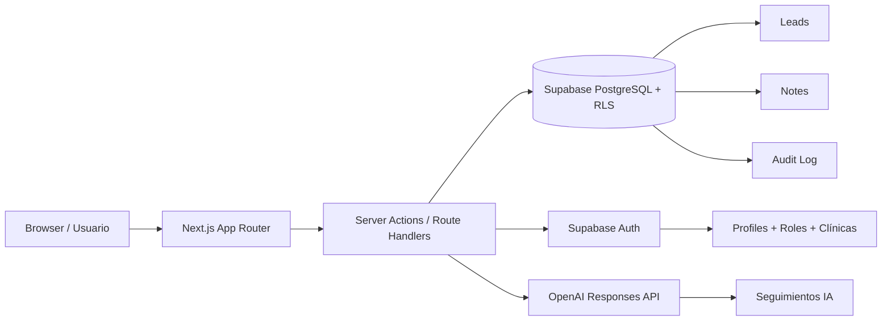

# Clínica Dental Vitalis

<div align="center">

[](https://crmleads.carlosrevert.es/login)
[](https://nextjs.org/)
[](https://www.typescriptlang.org/)
[](https://supabase.com/)
[](https://openai.com/)
[](https://vitest.dev/)

</div>

Un CRM interno para gestionar leads, notas, clínicas, usuarios, permisos y seguimientos de ventas, construido como proyecto de práctica y como prueba de talento para un proceso de contratación.

Este repositorio reúne una implementación completa y funcional de una aplicación empresarial con arquitectura modular, autenticación real, autorización por roles, auditoría, dashboard operativo y soporte de IA para redactar mensajes de seguimiento con revisión humana.

## 🎯 Qué es este proyecto

Clínica Dental Vitalis es una solución web orientada a equipos comerciales y administrativos de una cadena de clínicas dentales. El objetivo principal es centralizar la captación de leads, organizar su seguimiento, controlar qué persona puede ver o modificar cada dato, y facilitar la gestión diaria sin depender de herramientas dispersas.

El proyecto está pensado para demostrar:

- solidez técnica y claridad de arquitectura;
- capacidades de desarrollo full-stack con Next.js;
- razonamiento sobre seguridad, permisos y auditoría;
- dominio funcional realista y flujo de negocio completo;
- una interfaz usable, clara y preparada para presentación profesional.

## ✅ Estado actual

La aplicación ya está operativa y completa. Se han implementado las 16 fases del roadmap, incluyendo:

- autenticación y autorización por roles;
- gestión de clínicas y usuarios;
- CRUD de leads;
- notas append-only;
- auditoría de cambios;
- dashboard operativo;
- IA para generar seguimientos supervisados;
- testing integral y preparación para despliegue.

### En producción

- App: https://crmleads.carlosrevert.es/login
- Repositorio: https://github.com/RevertDeveloper/LeadsDental

## ✨ Principales ventajas

- Arquitectura modular y mantenible
- Seguridad real con Supabase Auth + PostgreSQL RLS
- Autorización server-side y control por clínica
- UX limpia, moderna y fácil de entender
- Pipeline comercial con filtros y priorización
- Auditable y preparado para crecimiento
- IA útil para acelerar redacción de seguimientos sin sustituir al usuario

## 🧩 Stack tecnológico

| Capa | Tecnología |
|---|---|
| Frontend | Next.js 16, React 19, TypeScript |
| Estilos | Tailwind CSS, shadcn/ui |
| Backend | Next.js Server Actions y Route Handlers |
| Autenticación | Supabase Auth |
| Base de datos | Supabase PostgreSQL |
| Seguridad | Row Level Security (RLS) + autorización server-side |
| Validación | Zod |
| IA | OpenAI Responses API |
| Tests | Vitest + Playwright |
| Deploy | Vercel |

## 🏗️ Arquitectura general



### Cómo está organizada la solución

- La capa de presentación vive en `app/` y `components/`
- La lógica de dominio y servicios está separada en `lib/`
- Los tipos compartidos se centralizan en `types/`
- La base de datos y las políticas viven en `supabase/`
- Los tests están distribuidos en `tests/`
- La documentación operativa y técnica se mantiene en `docs/`

## 📁 Estructura del proyecto

```text
.
├── app/                        # App Router, páginas y rutas protegidas
├── components/                 # Componentes reutilizables y UI
├── lib/                       # Lógica de negocio, permisos, IA, clientes Supabase
├── types/                     # Tipos TypeScript compartidos
├── supabase/                  # Migraciones, seed, políticas RLS y tests SQL
├── tests/                     # Tests unitarios y de integración
├── docs/                      # Arquitectura, desarrollo, despliegue y auditoría
├── scripts/                   # Scripts de apoyo: usuarios demo y dataset demo
├── public/                    # Assets estáticos
├── Documentos_Iniciales/      # Roadmap, entregas y documentación inicial
├── package.json               # Scripts y dependencias
├── next.config.ts             # Configuración de Next.js
├── vitest.config.mts          # Configuración de Vitest
├── playwright.config.ts       # Configuración de Playwright
├── components.json            # Configuración de shadcn/ui
├── eslint.config.mjs          # Reglas de lint
├── tsconfig.json              # Configuración TypeScript
├── .env.example               # Contrato de variables de entorno
├── README.md                  # Documentación principal
└── ...
```

## 🚀 Funcionalidades principales

### CRM y gestión de leads

- listado de leads con búsqueda y filtros
- orden por recientes, última actividad u antiguos
- pipeline comercial y priorización visual
- edición de lead y cambio de estado
- detección de duplicados y control manual
- soft delete para preservar trazabilidad

### Gestión de clínicas y usuarios

- administración de clínicas
- activación/desactivación de clínicas
- creación de usuarios internos con roles
- asignación de clínicas por usuario
- restricciones de acceso por rol y clínica

### Notas y auditoría

- notas append-only con historial de actividad
- auditoría completa de acciones relevantes
- trazabilidad de creación, cambios y eliminaciones

### IA asistida

- generación de mensajes de seguimiento desde servidor
- revisión humana antes de enviar
- respuestas alineadas con el tono comercial del proyecto

### Dashboard operativo

- métricas de leads por clínica
- leads recientes
- necesidades de atención
- vista rápida del estado del negocio

## 🔐 Seguridad y autorización

Este proyecto va más allá de una simple interfaz con botones: la seguridad real está implementada en server-side y en PostgreSQL.

### Modelo de protección

- Supabase Auth para identificar usuarios
- perfiles activos y roles definidos en la base de datos
- `user_clinics` para limitar acceso por clínica
- RLS para aislar datos por usuario y permisos
- validaciones con Zod en todas las entradas relevantes
- secretos del backend nunca expuestos al navegador

### Roles del sistema

- ADMIN: acceso global, gestión de usuarios y configuración
- CLINIC_MANAGER: acceso a las clínicas asignadas
- RECEPTIONIST: acceso operativo a su clínica

## 🛠️ Inicio rápido

### Requisitos

- Node.js >= 20.9
- npm >= 10
- una cuenta de Supabase con proyecto configurado
- una clave de OpenAI válida

### 1) Instalar dependencias

```bash
npm ci
```

### 2) Configurar variables de entorno

Copia el contrato de entorno y completa los valores reales:

```bash
cp .env.example .env.local
```

Variables clave:

- `NEXT_PUBLIC_SUPABASE_URL`
- `NEXT_PUBLIC_SUPABASE_ANON_KEY`
- `SUPABASE_SERVICE_ROLE_KEY`
- `OPENAI_API_KEY`
- `OPENAI_MODEL`
- `NEXT_PUBLIC_APP_URL`
- `DEMO_USER_PASSWORD`

> Importante: nunca subas credenciales reales ni variables sensibles al repositorio.

### 3) Iniciar el proyecto

```bash
npm run dev
```

La aplicación queda disponible en:

```text
http://localhost:3000
```

### 4) Preparar usuarios y datos demo

```bash
npm run demo:users
npm run demo:data
```

Esto crea usuarios demo y un conjunto funcional de leads para explorar la app con datos realistas.

## 🧪 Testing y calidad

El proyecto incluye validaciones de calidad a varios niveles:

### Unit tests

```bash
npm test
```

### Type checking

```bash
npm run typecheck
```

### Lint

```bash
npm run lint
```

### Build

```bash
npm run build
```

### E2E

```bash
npm run test:e2e
```

Las pruebas están diseñadas para cubrir tanto la lógica de negocio como los flujos importantes del usuario.

## 📚 Documentación incluida

Este repositorio incluye documentación técnica útil para seguir el proyecto y desplegarlo:

- [docs/architecture.md](docs/architecture.md)
- [docs/development.md](docs/development.md)
- [docs/production-deployment.md](docs/production-deployment.md)
- [docs/security-audit.md](docs/security-audit.md)
- [docs/demo-script.md](docs/demo-script.md)
- [Documentos_Iniciales/roadmap.md](Documentos_Iniciales/roadmap.md)

## 🌍 Despliegue

La app está preparada para desplegarse en Vercel y ya se ha validado en producción con dominio personalizado.

Para desplegar:

1. importar el repositorio en Vercel;
2. configurar las variables de entorno;
3. apuntar el dominio a Vercel;
4. validar login, flujo de leads, auditoría y generación IA.

Consulta [docs/production-deployment.md](docs/production-deployment.md) para la guía completa.

## 🤝 Contribución

Este proyecto fue desarrollado con enfoque de producto real y con una estructura clara para facilitar futuras ampliaciones.

Si quieres contribuir:

1. crea una rama descriptiva;
2. mantiene estándares de código y validación;
3. ejecuta lint, typecheck, tests y build antes de cerrar cambios;
4. documenta cualquier ajuste funcional importante.

## 📌 Nota sobre licencia

Este repositorio no incluye una licencia explícita en el package manifest, por lo que su uso está orientado a práctica profesional, portfolio, presentación y validación técnica interna.

## 🧠 Resumen ejecutivo

Clínica Dental Vitalis es un proyecto de práctica con una fuerte orientación a calidad técnica, claridad de producto y capacidad para resolver problemas reales de negocio. A través de una arquitectura modular, permisos sólidos, IA útil y una interfaz cuidada, demuestra que el equipo detrás del proyecto es capaz de construir una aplicación completa, coherente y lista para presentar en un proceso de contratación.

---

Si quieres, este README también puede adaptarse a un formato más “portfolio” o más “empresa”, con un tono todavía más premium y orientado a recruiters.
